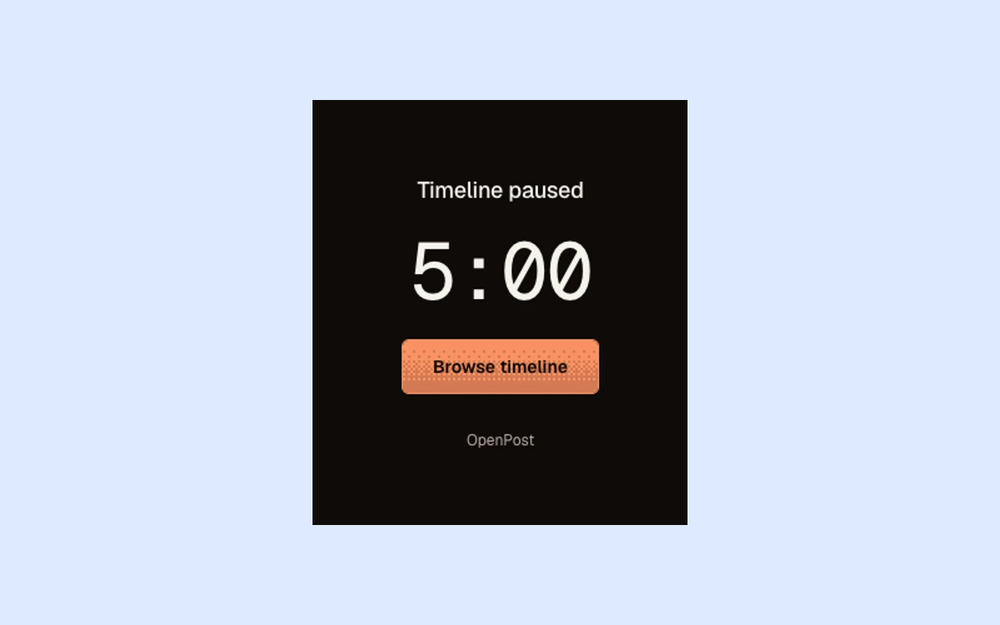

# X Timeline Blocker

Five minutes of timeline browsing per hour. Keep posting, messages and notifications available while the feed is paused.

A browser extension by [OpenPost](https://openpo.st) for Chromium and Firefox. It works entirely locally and stores only its timer.



The actual extension blocking the feed on OpenPost’s X preview.

## How it works

Open X's home timeline and click **Browse timeline** to start a five-minute window. When time runs out, the feed pauses again. Your next window is available one hour after the previous one started.

For example, starting at 10:00 gives you access until 10:05. You can start another window at 11:00.

- One timer follows you across tabs and browser restarts. Closing a tab does not pause the countdown.
- The popup shows time left or the countdown to your next window. The toolbar badge shows remaining browsing minutes.
- Only the home timeline on `x.com` and `twitter.com` is gated. Posting, messages, notifications, profiles, bookmarks and individual posts remain available.

## Install

Requires Chromium 120+ or Firefox 142+.

### Build from source

Use [Devenv](https://devenv.sh/) to enter the project's Node.js 24 environment:

```sh
devenv shell
npm ci
npm run build
```

The build produces `dist/chromium/` and `dist/firefox/`.

### Chromium

1. Open `chrome://extensions` and enable **Developer mode**.
2. Choose **Load unpacked** and select `dist/chromium/`.
3. Pin the extension and open X's home timeline. You should see **Timeline paused** and a **Browse timeline** button.

### Firefox

1. Open `about:debugging#/runtime/this-firefox`.
2. Choose **Load Temporary Add-on** and select `dist/firefox/manifest.json`.
3. Open X's home timeline. You should see **Timeline paused** and a **Browse timeline** button.

Temporary Firefox installations last until the browser closes. For a persistent installation, use a Mozilla-signed release.

## Development

Run commands from the project directory inside `devenv shell`.

```sh
npx playwright install chromium firefox
npm run check          # Svelte, TypeScript, ESLint and formatting
npm test               # Timer and coordination tests
npm run test:browser   # Packaged Chromium and native Firefox tests
npm run lint:firefox   # Lint the built Firefox extension
npm run verify         # All checks and tests, including Firefox lint
npm run package        # Chromium, Firefox and source ZIPs in artifacts/
```

Browser tests use isolated profiles and intercepted X/Twitter pages. They cover shared timers, expiry, restarts, navigation, timeline replacement and accessibility.

The UI uses Svelte 5, Vite and `@openpost/ui`, with a fixed orange Dither theme and system light/dark appearance. Versioned UI packages are included in `vendor/`; a sibling OpenPost checkout is not required. See [product scope](PRODUCT.md), [design](DESIGN.md) and [contributor instructions](AGENTS.md).

## Chrome Web Store releases

A matching version tag runs verification, uploads the Chromium package and submits it for Google review. Follow [the one-time publisher and GitHub setup](docs/chrome-release.md) before the first release.

## Firefox releases

The **Submit Firefox** workflow submits a listed version to Mozilla Add-ons on a `v<package version>` tag or manual dispatch. Set `AMO_API_KEY` and `AMO_API_SECRET` in the repository's `firefox-store` environment.

The workflow verifies the extension and uploads its build source for Mozilla review. Listing metadata lives in [docs/amo-metadata.json](docs/amo-metadata.json).

## License

[AGPL-3.0-only](LICENSE).
